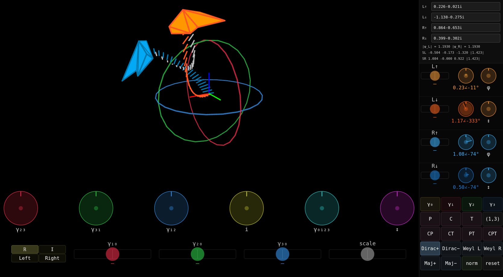

# Dirac Spinors — Interactive Visualization

**[Live demo →](https://aap.github.io/dirac-toy)**

A hands-on visualization of a Dirac spinor as two Weyl spinors, rendered in 3D with a Lorentz group control panel.



---

## What are Dirac spinors?

In 1928 Paul A.M. Dirac discovered that to describe matter both quantum mechanically *and* relativistically
one needs a supposedly mysterious new thing called a Spinor, made up of four complex numbers.

These are usually considered hard or impossible to understand let alone visualize,
and in any case they're treated as more of a geometric obscurity rather than
a very simple building block with which to understand geometry.

One example of this perspective is Richard Behiel's
[The Mystery of Spinors](https://www.youtube.com/watch?v=b7OIbMCIfs4).
For a very algebraic approach see eigenchris' [Spinors for Beginners](https://www.youtube.com/playlist?list=PLJHszsWbB6hoOo_wMb0b6T44KM_ABZtBs)

The symmetries given to us by Special Relativity are the continuous
transformations in one dimension of Time and three of Space,
the Lorentz-group Spin(1,3) (= Spin(3,1)).
To see what this group does we need it to act on something that we can visualize.

4-vectors (and more general tensors) are a well known possibility,
but it turns out that there is always a pair of transformations which
act identically on the vector.
And in any case it is very hard to visualize a 4D vector.

Spinors are the more elementary thing that the Lorentz-group acts on,
and they are easier to picture too!
A full Dirac spinor can be split up into a Left- and a Right-handed Weyl spinor,
where each spinor can be pictured as exactly that:
a left or a right hand, attached to some point with an arm.
The continuous symmetries keep left and right separate,
the 1+3 mirrors (γ₀, γ₁, γ₂, γ₃) of spacetime generate them as compositions
of an even number of reflections.

--- TODO: explain more

The phase dials in the right panel show each of the four complex components (L↑, L↓, R↑, R↓) as a filled arc: radius = amplitude, swept angle = phase argument. Clockwise = negative phase, counterclockwise = positive.

## Controls

### 3D view (main canvas)
- **Drag** — orbit camera
- **Scroll** — zoom

### Lorentz strip (bottom)

Four mode buttons select which Lorentz action the knobs apply:

| Mode | Action |
|------|--------|
| **ℝ** | Real Spin(1,3) |
| **ℑ** | Imaginary Spin(1,3) |
| **Left** | Chiral left — acts on ψ_L only |
| **Right** | Chiral right — acts on ψ_R only |

**Dials (RGB):** three spatial rotation axes (red/green/blue = x/y/z)  
**Dials (YCM):** i phase rotation, γ₀₁₂₃ axial rotation, local up/down ↕ rotation (yellow/cyan/magenta)  
In Left/Right mode these become right-multiplied (= local!) ρ₃, ρ₁, ρ₂ rotations on the active hand.

**Sliders:** three spatial boost axes + scale/weight

### Component panel (right)

Four rows: L↑, L↓, R↑, R↓.  
- **Amplitude slider** (left) — sets the magnitude of that component  
- **Phase dial** (middle-left) — rotates the phase of that component  
- **φ knob** (top-right per chirality pair) — overall phase of that hand  
- **ρ₂ knob** (bottom-right per chirality pair) — rotates between up and down locally

### Discrete symmetries

CLAUDE: explain that γ's are reflections in space and parity.
two ways to do that.

CLAUDE: CPT are symmetries of the dirac equation. see how they act on spinors here

### Eigenstate buttons
- **Dirac+/−** — project onto ±1 eigenstates of γ⁰ (particle/antiparticle in the Dirac sense)
- **Majorana+/−** — project onto ±1 eigenstates of charge conjugation C
- **Weyl L/R** — project onto pure left- or right-handed chirality eigenstates
- **Reset** — restore default (equal left+right)

The spinor readout at the top of the right panel shows each component in the form `a+bi`.

---

## Math

The math could be simplified somewhat by just using matrices,
everything is done purely in terms of quaternions.

The spinor is `ψ = [ψ_L, ψ_R]` where each is a quaternion treated as a Weyl spinor.
The familiar complex coefficients are extracted as follows:

```
up(q)   = (q.w, −q.z)   — a complex number
down(q) = (q.y, −q.x)
```

Lorentz group action in this representation:

```
spin3(θ, n̂, ψ)  = [R·ψ_L,  R·ψ_R]        R = exp(θ·n̂)  ∈ Spin(3)
boost(θ, n̂, ψ)  = [cosh(θ)·ψ_L + sinh(θ)·n̂·ψ_L·(−ρ₃),
                    cosh(θ)·ψ_R + sinh(θ)·n̂·ψ_R·ρ₃]
```

where quaternion multiplication implements the Spin(3) group and ρ₁,ρ₂,ρ₃ are the standard quaternion basis elements.

---

## Running locally

```
cd dirac-toy
python3 -m http.server 8000
# open http://localhost:8000
```

The `hand.obj` model is loaded asynchronously; the canvas starts sleeping and wakes on interaction to conserve CPU.

## Credits

Math done by myself, UI and initial README by Claude Code.
